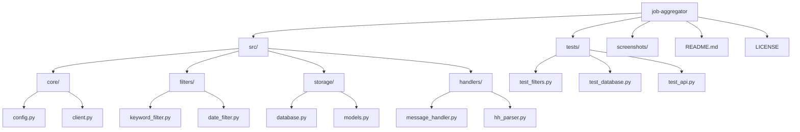
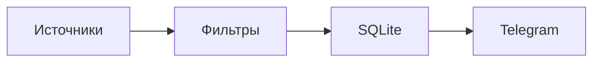

# 🤖 IT Job Aggregator Bot

  <h3>Автоматический агрегатор IT-вакансий с умной фильтрацией</h3>

---

## 📋 О проекте

Бот собирает IT-вакансии из 30+ источников, фильтрует по стеку и отправляет только релевантные в Telegram.

**Что умеет:**
- 🧠 Сбор вакансий из множества источников
- 🧠 Умная фильтрация (Playwright, TypeScript, Python, QA)
- 🧠 Сохранение в SQLite
- 🧠 Отправка в Telegram канал
- 🧠 Защита от дубликатов
- 🧠 Лимиты и паузы

---
## 📁 Структура проекта

## 🏗️ Архитектура

---

## 📸 Демонстрация

### Терминал
<table>
  <tr>
    <td align="center">
       
      <b>Запуск бота</b>
    </td>
    <td align="center">
       
      <b>Обработка вакансий</b>
    </td>
  </tr>
</table>

### Telegram-канал
<table>
  <tr>
    <td align="center">
       
      <b>Вакансии QA</b>
    </td>
    <td align="center">
       
      <b>Фильтрация</b>
    </td>
    <td align="center">
       
      <b>Отправка</b>
    </td>
  </tr>
</table>
---

## 📊 Результаты

| Метрика | Значение |
|---------|----------|
| Источников | 30+ |
| Вакансий в день | 50 |
| Релевантность | 95% |
| Ручной работы | 0 |

---

## 🛠️ Стек

- Python 3.13
- Playwright
- SQLite
- asyncio
- pytest

---

## ⚠️ Исходный код

Исходный код находится в **приватном репозитории**.

Демонстрация доступна на собеседовании или по запросу.

**Контакт:** [Telegram](https://t.me/fridmo_sony)

---

## 👨‍💻 Автор

**Sony Fridmo** — QA Automation Engineer

---

  Built with ❤️ by QA Automation Engineer

