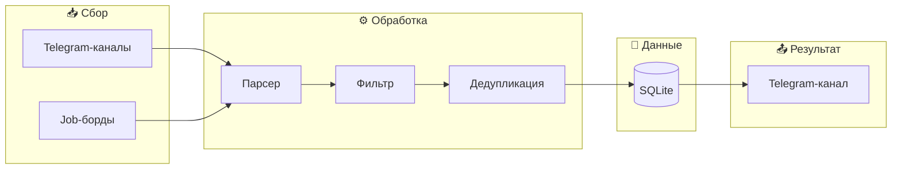
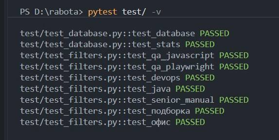
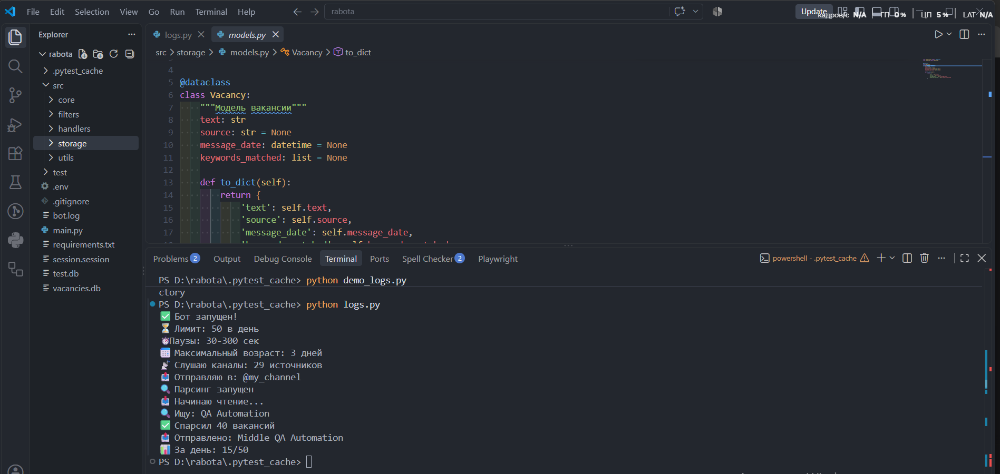
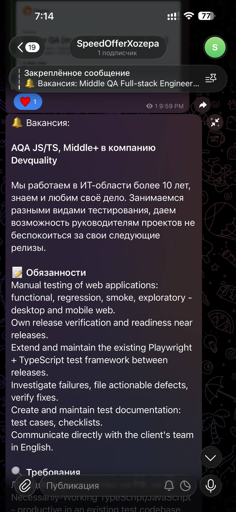
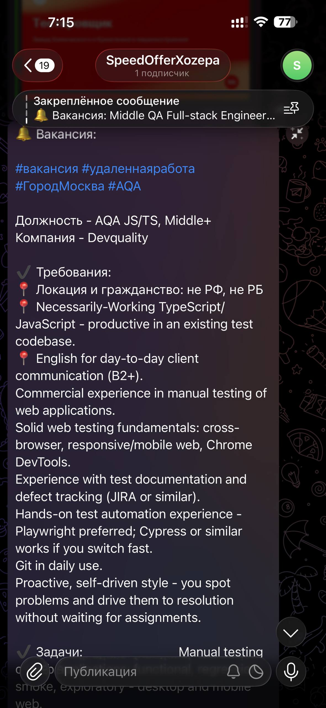
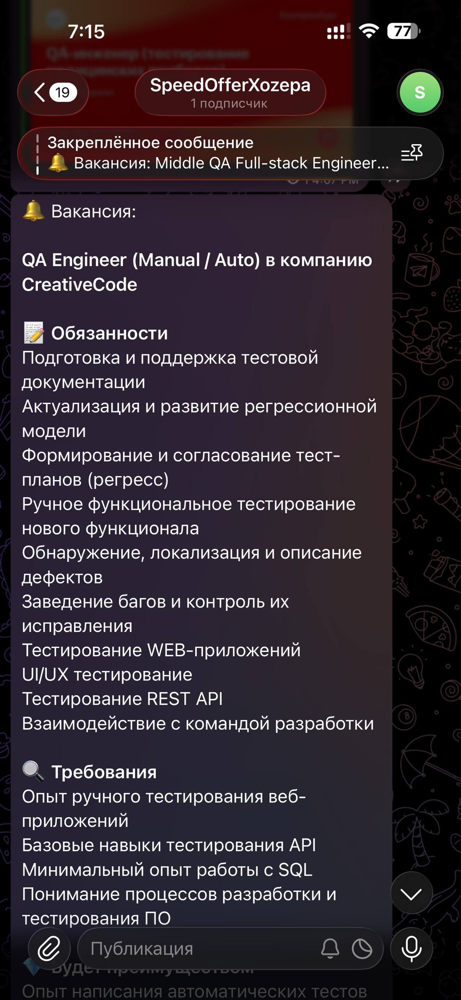

# IT Job Aggregator Bot

---

## 💡 Зачем нужен этот бот

Поиск работы в IT — это рутина: десятки каналов, мусор, пропущенные вакансии. Бот найдет и автоматизиурет всё за вас:

- **Читает 30+ источников** — Telegram, job-борды
- **Фильтрует по стеку**
- **Убирает мусор** — неактуальную информацию
- **Присылает только релевантное** — в приватный индивидуальный Telegram-канал

**Результат:** 2-3 часа рутины → 5 минут просмотра.

---

## 🎯 Специфика

🔍 Нажми, чтобы раскрыть

На первый взгляд кажется: «Ну, парсинг, фильтр — что тут сложного?»

На самом деле:

- **Источники разные** — Telegram-каналы, сайты, API. У каждого своя структура.
- **Данные грязные** — вакансии дублируются, содержат мусор, рекламу, подборки.
- **Фильтры неочевидны** — у каждых вакансий своя структура. Например, «удалёнка» пишется 10 способами.
- **Лимиты и защита** — источники не любят автоматизацию. Нужны паузы, ротация.
- **Надёжность** — бот работает 24/7, не падает, не шлёт дубли, не теряет данные.

**Это компактный продукт с архитектурой, базой данных, логированием и тестами.**

---

## 🏗️ Архитектура

---

## 📸 Демонстрация

### 🖥️ Терминал

<table>
  <tr>
    <td align="center">
       
      <b>🛡️ На страже автотесты</b>
    </td>
    <td align="center">
       
      <b>🚀 Запуск бота с инфо</b>
    </td>
  </tr>
</table>

### 📱 Telegram-канал

<table>
  <tr>
    <td align="center">
       
      <b>💼 Вакансии QA</b>
    </td>
    <td align="center">
       
      <b>🎯 Вакансии</b>
    </td>
    <td align="center">
       
      <b>📤 Вакансии</b>
    </td>
  </tr>
</table>

---

## 📊 Результаты

| 📈 Метрика | 🎯 Значение |
|:----------:|:-----------:|
| **Источников** | 30+ |
| **Вакансий в день** | 50 |
| **Релевантность** | 95% |
| **Ручной работы** | 0 |

---

## 🛠️ Стек

  

---

## 🗺️ Roadmap

- [x] Сбор из Telegram
- [x] Сбор с job-бордов
- [x] Умная фильтрация
- [x] Сохранение в SQLite
- [x] Защита от дубликатов
- [x] Автотесты

---

## **Нужен похожий бот для ваших задач?**

Напишите мне - обсудим любые идеи:

**Sony Fridmo** — QA Automation Engineer

---
## ⚠️ Исходный код

Исходный код находится в **приватном репозитории**.

Демонстрация доступна по запросу.

---

  
   
  Built with ❤️ by QA Automation Engineer

