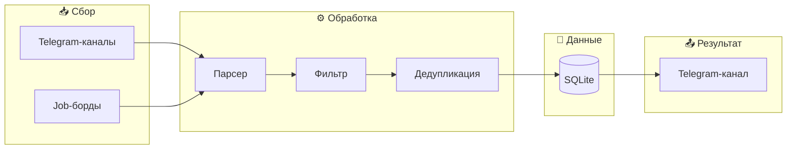

# 🤖 IT Job Aggregator Bot

  <h3>Автоматический агрегатор IT-вакансий с умной фильтрацией</h3>

---

## 💡 Зачем нужен этот бот

Поиск работы в IT — это рутина: десятки каналов, мусор, пропущенные вакансии. Бот автоматизирует всё:

- **Читает 30+ источников** — Telegram, job-борды
- **Фильтрует по стеку**
- **Убирает мусор** 
- **Присылает только релевантное** — в удобный Telegram-канал

**Результат:** 2-3 часа рутины → 5 минут просмотра.

---

## 🎯 Сложности
На первый взгляд кажется: «Ну, парсинг, фильтр — что тут сложного?»

На самом деле:

- **Источники разные** — Telegram-каналы, сайты, API. У каждого своя структура.
- **Данные грязные** — вакансии дублируются, содержат мусор, рекламу, подборки.
- **Фильтры неочевидны** — у каждых вакансий своя структура. Например, «удалёнка» пишется 10 способами 
- **Лимиты и защита** — источники не любят автоматизацию. Нужны паузы, ротация.
- **Надёжность** — бот работает 24/7, не падает, не шлёт дубли, не теряет данные.

**Это компактный продукт с архитектурой, базой данных, логированием и тестами.**

---

## 🏗️ Архитектура

---

## 📸 Демонстрация

### Терминал

<table>
  <tr>
    <td align="center">
       
      <b>На страже стоят автотесты</b>
    </td>
    <td align="center">
       
      <b>Запуск бота с инфо</b>
    </td>
  </tr>
</table>

### Telegram-канал

<table>
  <tr>
    <td align="center">
       
      <b>Вакансии QA</b>
    </td>
    <td align="center">
       
      <b></b>
    </td>
    <td align="center">
       
      <b></b>
    </td>
  </tr>
</table>

---

## 📊 Результаты

| Метрика | Значение |
|---------|----------|
| Источников | 30+ |
| Отфильтрованных вакансий в день | 50 |
| Релевантность | 95% |
| Ручной работы | 0 |

---

## 🛠️ Стек

- Python 3.13
- Playwright
- SQLite
- asyncio
- pytest

---

## ⚠️ Исходный код

Исходный код находится в **приватном репозитории**.

Демонстрация доступна на собеседовании или по запросу.

**Контакт:** [Telegram](https://t.me/fridmo_sony)

---

## 👨‍💻 Автор

**Sony Fridmo** — QA Automation Engineer

---

  Built with ❤️ by QA Automation Engineer

