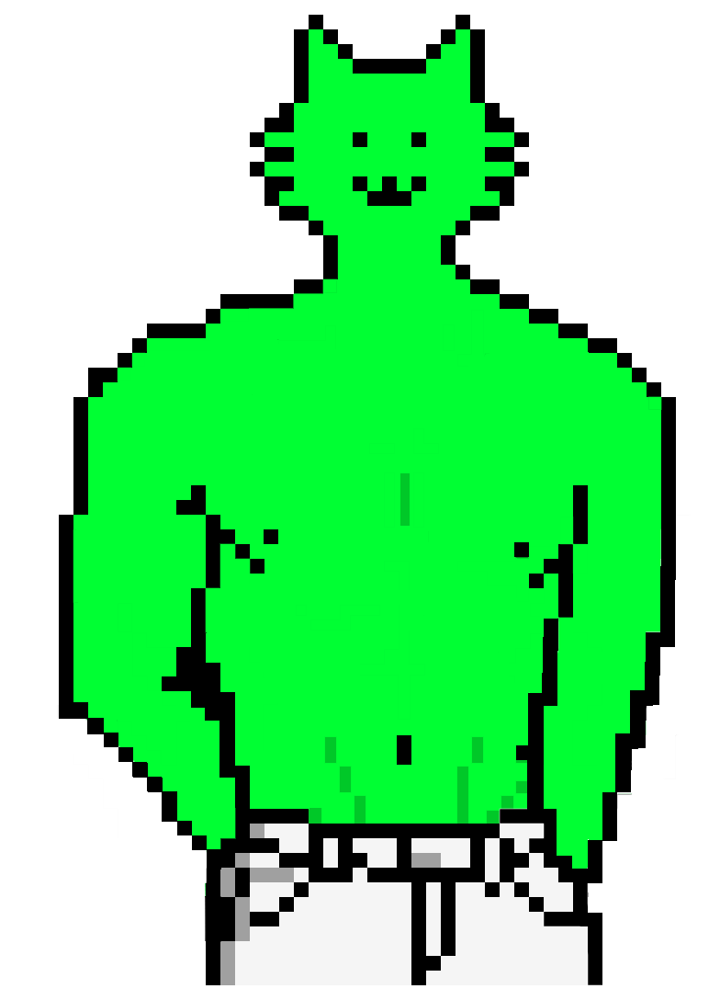
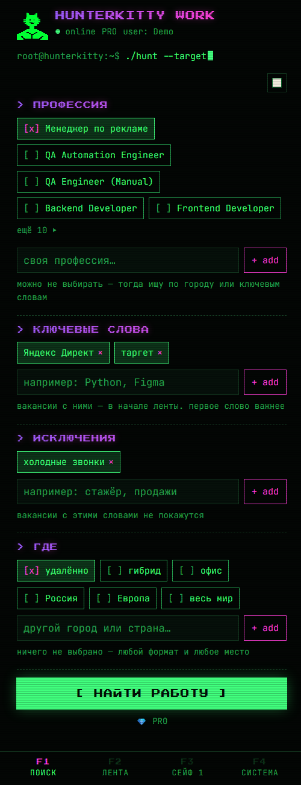
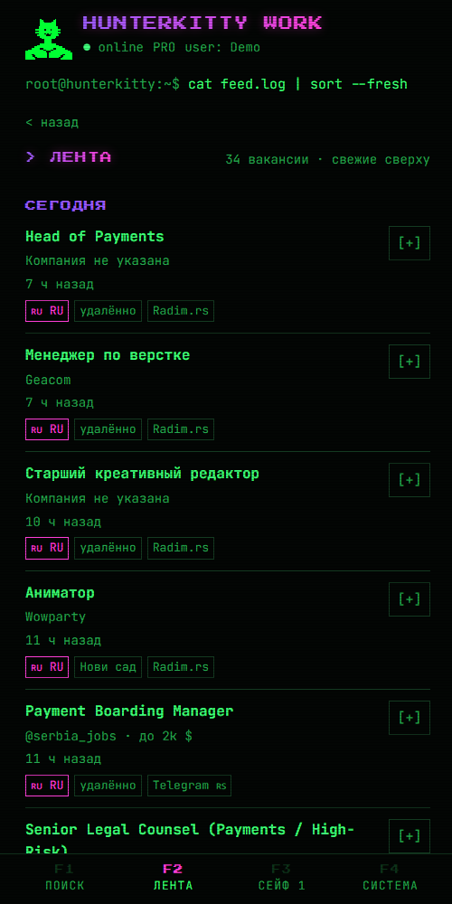
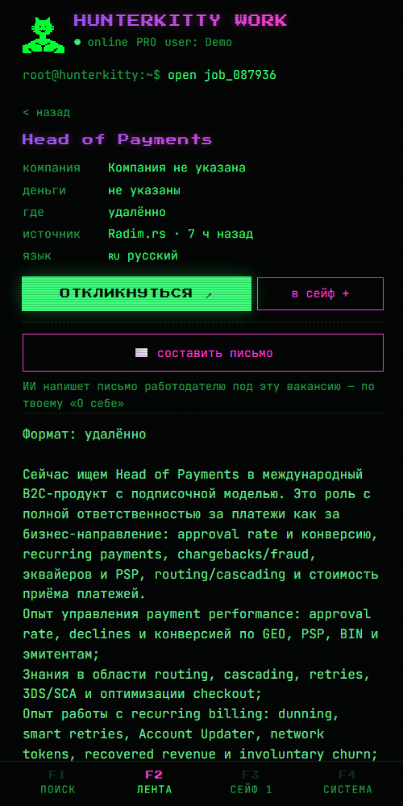
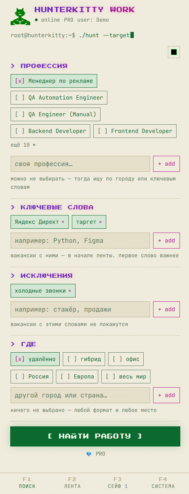
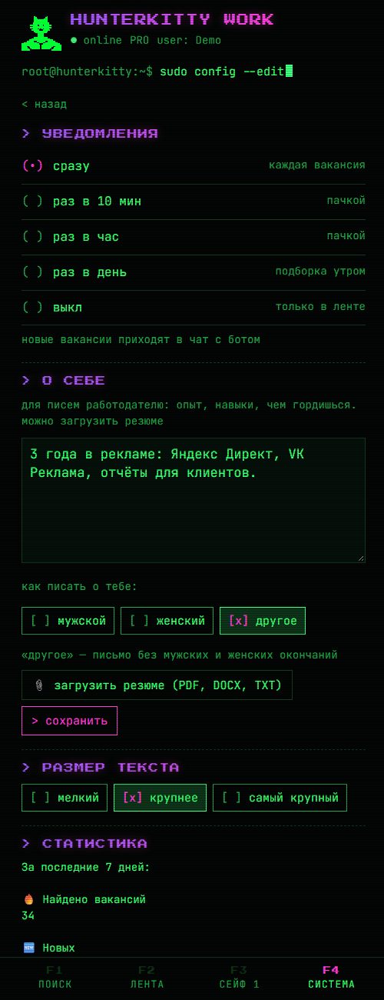
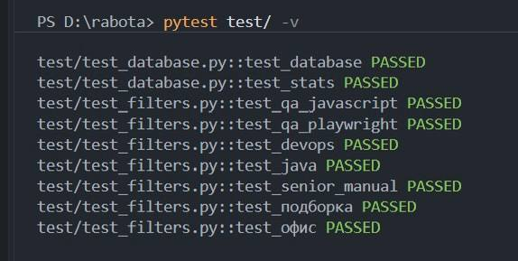
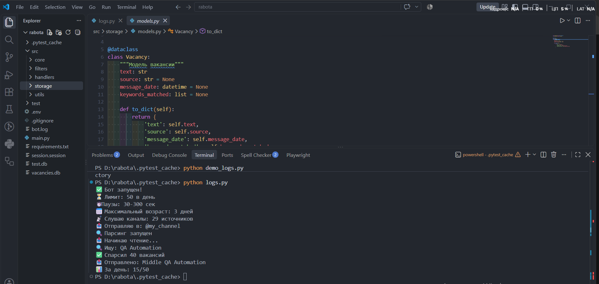
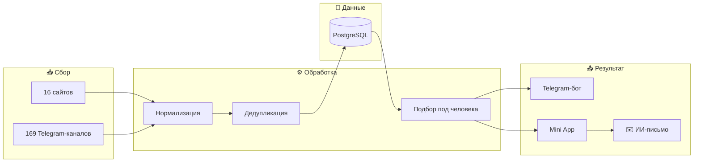

# HunterKitty Work

---

## 💡 Что это

На вакансию откликаются в первые часы — кто раньше, у того шанс выше. HunterKitty Work собирает свежие вакансии со всех площадок в одну ленту и присылает новые сразу, как их опубликовали.

- **16 сайтов и 169 Telegram-каналов** сайты и каналы читаются в реальном времени
- **3000+ новых вакансий в день** — дубли, реклама, резюме и мошенники отсеиваются
- **Точный подбор** — профессия, ключевые слова, слова-исключения, город, формат работы
- **✉️ Письмо работодателю** — ИИ составляет сопроводительное под конкретную вакансию
- **Telegram-бот и Mini App** — лента, сохранённые, уведомления «сразу / раз в час / раз в день»

---

## 📸 Mini App

Терминал в стиле 2000-х: две темы, три размера текста.

<table>
  <tr>
    <td align="center"> <b>🔎 Поиск</b></td>
    <td align="center"> <b>📜 Лента</b></td>
    <td align="center"> <b>💼 Вакансия и письмо</b></td>
  </tr>
  <tr>
    <td align="center"> <b>☀️ Светлая тема</b></td>
    <td align="center"> <b>✍️ О себе и настройки</b></td>
  </tr>
</table>

### 🖥️ Терминал

<table>
  <tr>
    <td align="center">
       
      <b>🛡️ На страже автотесты</b>
    </td>
    <td align="center">
       
      <b>🚀 Запуск бота с инфо</b>
    </td>
  </tr>
</table>

---

## 🎯 Что внутри

🔍 Нажми, чтобы раскрыть

- **Нормализация** — зарплата, город, формат работы («удалёнка» пишется десятком способов), опыт, дедупликация одной вакансии с разных площадок.
- **Подбор** — синонимы профессий и «родственные» роли, конфликт ролей и стеков, жёсткие фильтры и ранжирование, «умные» ключевые слова.
- **Уведомления** — сразу, пачкой или утренней подборкой; ничего не теряется.
- **Mini App** — aiohttp + PYTHON и JS внутри процесса бота.
- **Подписка** — пробный период, бесплатный режим с лимитами и PRO с оплатой через ЮKassa.
- **Надёжность** — воркер отдельно от бота (кнопки не подвисают), расчёт подбора в отдельных процессах, ночные бэкапы базы, 292 автотеста.

---

## 🏗️ Архитектура

```mermaid
flowchart LR
    subgraph INPUT["📥 Сбор"]
        direction TB
        SITES[16 сайтов]
        TG[169 Telegram-каналов]
    end

    subgraph PROCESS["⚙️ Обработка"]
        direction TB
        N[Нормализация]
        D[Дедупликация]
        M[Подбор под человека]
    end

    subgraph DATA["💾 Данные"]
        DB[(PostgreSQL)]
    end

    subgraph OUTPUT["📤 Результат"]
        direction TB
        BOT[Telegram-бот]
        APP[Mini App]
        AI[✉️ ИИ-письмо]
    end

    SITES --> N
    TG --> N
    N --> D --> DB --> M
    M --> BOT
    M --> APP
    APP --> AI
```

---

## 📊 Цифры

| 📈 Метрика | 🎯 Значение |
|:----------:|:-----------:|
| **Сайтов** | 16 |
| **Telegram-каналов** | 169 |
| **Новых вакансий в день** | 3000+ |
| **Автотестов** | 292 |

---

## 🛠️ Стек

 

  

**Python · aiogram · Telethon · aiohttp · SQLAlchemy · PostgreSQL · Alembic · APScheduler · pytest**

---

## 🗺️ Roadmap

- [x] Сбор с сайтов и из Telegram-каналов
- [x] Подбор: синонимы профессий, фильтры, ключевые слова, исключения
- [x] Защита от дублей, рекламы и мошеннических «вакансий»
- [x] Уведомления о новых вакансиях
- [x] Mini App: тёмная и светлая темы
- [x] ✉️ Письмо работодателю через ИИ
- [x] Подписка PRO и оплата
- [x] Процент совпадения в ленте

---

## Нужен похожий бот для ваших задач?

  

**Sony Fridmo**

---

## ⚠️ Исходный код

Исходный код находится в **приватном репозитории**.

Демонстрация доступна по запросу.

---

  
   
  Built with ❤️ by QA Automation Engineer

